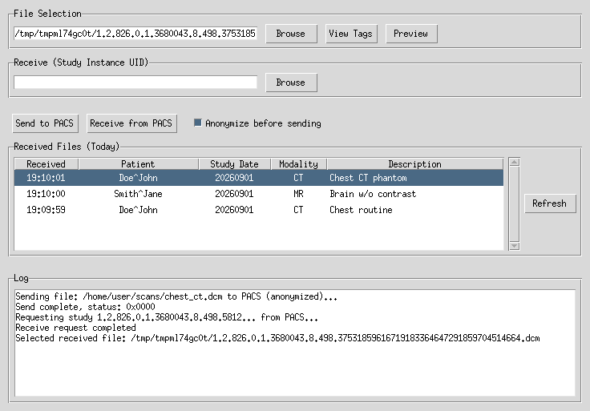
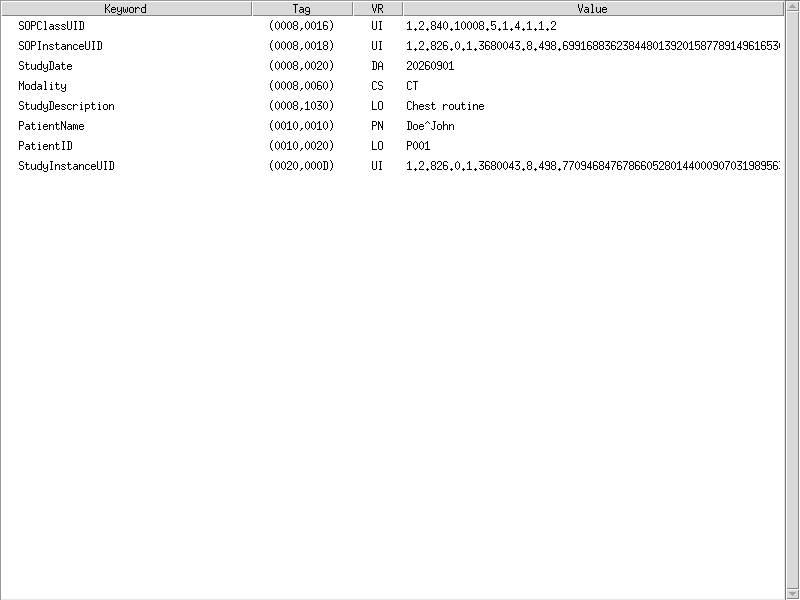
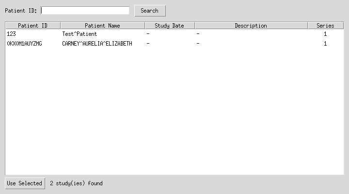

# DICOM Connector


A Tkinter desktop application for loading, transferring, and cataloging DICOM
medical imaging files against a PACS (e.g. Orthanc).

## Features

- DICOM file loading and parsing
- Metadata extraction and display
- Full DICOM tag browser (View Tags), including nested sequences
- Pixel data visualization (Preview) with window/level sliders, including
  compressed transfer syntaxes (JPEG, JPEG2000, ...) via pylibjpeg
- Anonymization before send (on by default), via dicognito
- Network DICOM transfer: C-ECHO, C-STORE, C-FIND, C-MOVE, and a Storage SCP
- In-app PACS browser (Browse next to Receive) to find a study by Patient
  ID and receive it in one click - no need to already know a Study
  Instance UID, and no separate "now click Receive" step
- Auto-refreshing "Received Files (Today)" panel that auto-selects the
  just-received file - View Tags/Preview/Send are immediately ready, no
  manual browsing
- Orthanc REST API client
- Database storage for DICOM metadata (PostgreSQL)
- Tkinter GUI

Pixel preview limitation (MVP): only the first frame of multi-frame data.

## Project Structure

```
connector/
├── Dockerfile
├── docker-compose.yml
├── Makefile
├── pyproject.toml
├── uv.lock
├── docker/
│   ├── orthanc-config/modalities.json   # registers dicom_app as a PACS modality
│   └── postgres-init/init-orthanc-db.sh # creates orthanc's own database
├── scripts/
│   ├── list_studies.py                  # CLI: list/filter studies on Orthanc
│   └── anonymize.py                     # CLI: batch-anonymize local files
├── src/
│   └── dicom_connector/
│       ├── main.py
│       ├── config.py
│       ├── ui/
│       │   ├── main_window.py
│       │   ├── tag_browser.py           # View Tags
│       │   ├── image_viewer.py          # Preview
│       │   └── pacs_browser.py          # Browse (find a study by Patient ID)
│       ├── dicom/
│       │   ├── file_handler.py
│       │   ├── network.py               # C-ECHO/C-STORE/C-FIND/C-MOVE, Storage SCP
│       │   ├── orthanc_api.py           # Orthanc REST client
│       │   ├── studies.py               # study summarizing/filtering, shared by the CLI and Browse
│       │   └── anonymizer.py            # wraps dicognito
│       └── database/
│           └── db_handler.py
└── tests/
```

## Prerequisites

- Python 3.11 or higher
- [uv](https://docs.astral.sh/uv/) for dependency management and running the app
- Docker 20.10+ and Docker Compose 2.0+ (for the containerized setup)
- A system Tk installation if running outside Docker (e.g. `python3-tk` on Debian/Ubuntu)

## Installation

### Using Docker Compose (Recommended)

1. Clone the repository:
```bash
git clone https://github.com/yourusername/dicom-connector.git
cd dicom-connector
```

2. Build and run the application, PostgreSQL, and an Orthanc PACS:
```bash
docker compose up --build
```

This is a desktop GUI application, not a web server - there is no
`http://localhost:8000` to open. On Linux, the container displays its window
on your host's X server (see `DISPLAY`/X11 notes in `docker-compose.yml`);
run `xhost +local:docker` on the host first if the window fails to appear.
Orthanc's web UI is reachable at `http://localhost:8042`.

### Manual Installation

1. Clone the repository:
```bash
git clone https://github.com/yourusername/dicom-connector.git
cd dicom-connector
```

2. Install dependencies with uv (creates and manages `.venv` for you):
```bash
uv sync
```

3. Copy the environment template and fill in real values - `config.py` loads
   `.env` automatically, including for this direct (non-Docker) path:
```bash
cp .env.example .env
```

4. Run the application:
```bash
uv run dicom-connector
# or: uv run python -m dicom_connector.main
```

## Configuration

The application is configured via `src/dicom_connector/config.py`, which
reads its values from environment variables (see `.env.example`):

| Variable | Purpose | Default |
|---|---|---|
| `DICOM_PACS_HOST` | PACS DICOM host | `localhost` |
| `DICOM_PACS_PORT` | PACS DICOM port | `4242` |
| `DICOM_PACS_AE_TITLE` | Remote PACS AE title | `ORTHANC` |
| `DICOM_CALLING_AE_TITLE` | This app's own AE title | `MYAETITLE` |
| `DICOM_DB_NAME` / `_USER` / `_PASSWORD` / `_HOST` / `_PORT` | PostgreSQL connection | `dicom_db` / `dicom_user` / `dicom_password` / `localhost` / `5432` |
| `ORTHANC_HTTP_URL` | Orthanc REST API base URL | `http://localhost:8042` |
| `ORTHANC_HTTP_USERNAME` / `ORTHANC_HTTP_PASSWORD` | Orthanc REST API credentials | `orthanc` / `orthanc` |

## Docker Configuration

`docker-compose.yml` runs three services: `dicom_app` (this application, on
the host network so it can reach the DICOM/PACS ports directly), `db`
(PostgreSQL), and `orthanc` (a PACS with its own PostgreSQL-backed index and
storage). All credentials are environment-variable driven - copy
`.env.example` to `.env` and change them before any real deployment.

A `Makefile` wraps the common operations - run `make help` for the full
list (`up`, `detach`, `build`, `rebuild`, `logs[-app|-db|-orthanc]`,
`restart[-app|-db|-orthanc]`, `shell[-db|-orthanc]`, `ps`, `down`,
`clean-volumes`, plus `test`/`lint`/`studies`). `make up`/`make build`/etc.
create `.env` from `.env.example` automatically if it's missing.
`make studies` lists what's currently synced in Orthanc (`ARGS="--patient
smith"` to filter, `ARGS="--json"` for scripting, etc.).

## Usage

1. Launch the application - it also starts a background Storage SCP
   (`DICOM_STORE_SCP_PORT`, default `11115`) so images pushed back by a
   PACS have somewhere to land
2. To send: use **Browse** to select a `.dcm` file, then **Send to PACS**;
   use **View Tags** to inspect its full DICOM dataset, or **Preview** to
   view pixel data with adjustable window center/width sliders
3. To receive a study: click **Browse** next to the Receive field to
   search studies on the PACS by Patient ID (via Orthanc's REST API), then
   double-click a row (or select it and click **Use Selected**). This
   issues a C-MOVE right away - no separate step needed - which only
   delivers files if the PACS knows this app as a registered DICOM
   modality pointing at its Storage SCP; the `docker compose` setup does
   this automatically via `docker/orthanc-config/modalities.json`, a
   different PACS needs the same registration (AE title, host,
   `DICOM_STORE_SCP_PORT`) added manually. (You can also type a Study
   Instance UID directly and click **Receive from PACS**, if you already
   have one.)
4. Received files land in `DICOM_STORAGE_DIR` (default `received_dicom/`),
   show up in the **Received Files (Today)** panel, and the just-received
   file is auto-selected into File Selection - **View Tags**/**Preview**/
   **Send to PACS** are immediately ready to use on it, no extra clicks.
   Selecting a different row does the same. The panel only lists files
   received today; use **Refresh** to re-scan the folder manually
5. Check the log pane for status and errors

### Screenshots

**Main window** - File Selection (Browse/View Tags/Preview), Receive
(Browse to find a study by Patient ID), Send/Anonymize, the Received
Files panel, and the log:



**View Tags** - the full DICOM dataset, including nested sequences:



**Preview** - pixel data with adjustable window center/width sliders:


**Browse** - find a study on the PACS by Patient ID:



### Utility Scripts

```bash
# list studies currently stored in Orthanc (table or --json), optionally
# filtered by --patient; see --help for connection overrides
uv run python scripts/list_studies.py

# anonymize local .dcm files (or whole directories) before sending them
# elsewhere; files from the same study keep consistent identifiers
uv run python scripts/anonymize.py study/ --output anonymized/
```

## Development

### Adding New Features

1. Create a new branch for your feature
2. Implement the feature following the project structure
3. Add tests under `tests/`
4. Submit a pull request

### Running Tests

```bash
uv run pytest tests/
```

Most of the suite is self-contained (mocked I/O, synthetic DICOM datasets,
a real local Storage SCP on an ephemeral port) and needs nothing running.
`test_orthanc_connection.py` is marked `integration` and requires a live
PACS/Orthanc (`docker compose up db orthanc`) - it skips cleanly, rather
than failing, when nothing is reachable. `test_main_window.py` exercises
the real Tk widgets and skips cleanly wherever no display is available.

### Linting

```bash
uv run ruff check src tests scripts
# or: make lint
```

## Contributing

1. Fork the repository
2. Create your feature branch (`git checkout -b feature/AmazingFeature`)
3. Commit your changes (`git commit -m 'Add some AmazingFeature'`)
4. Push to the branch (`git push origin feature/AmazingFeature`)
5. Open a Pull Request

## License

This project is licensed under the MIT License - see the LICENSE file for details.

## Acknowledgments

- DICOM standard documentation
- PyDICOM library
- Contributors and maintainers

## Support

For support, please open an issue in the GitHub repository or contact the maintainers.
